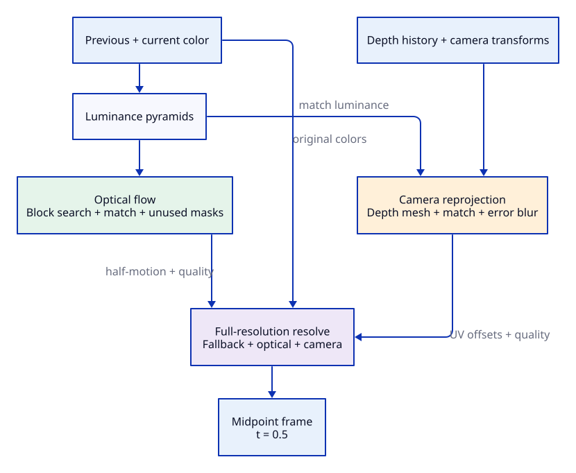

# Hydra interpolation

Hydra generates a frame halfway between two real frames (`t = 0.5`). It estimates
motion in two ways: **optical flow** finds corresponding image patterns, while
**camera reprojection** uses depth and camera transforms to predict where surfaces
move. The final pass blends these estimates with the original colors according
to how well the warped images agree.

This directory contains the shaders for the experimental WebGPU reconstruction
of Huawei SDKCore BASIC interpolation. The
[reference notes](../../../reference/hydra/README.md) cover its provenance,
input contract, and differences from the recovered implementation. Pass scheduling
and resource allocation live in
[HydraFrameGenerator.ts](../../orchestration/HydraFrameGenerator.ts).



The diagram groups related passes; the [detailed pass graph](../../../reference/hydra/passes.svg)
shows their individual connections. [Edit the D2 source](algorithm.d2).

## Inputs and output

The inputs are previous and current full-resolution linear LDR color, current
device depth, and a pair of clip-space transforms mapping between the frames.
Omitting the transforms uses an identity camera transform. Previous depth is
retained between calls; callers can supply it explicitly or reset the history.
The output is a full-resolution, opaque `rgba16float` midpoint image. This path
uses neither game motion vectors nor neural inference.

## How a frame is generated

### 1. Prepare smaller images

[luma.wgsl](luma.wgsl) converts each color image into half-resolution luminance.
[mipmap.wgsl](mipmap.wgsl) builds progressively smaller levels, up to five in the
current host implementation. Searching small images first lets local searches
cover larger movement in the original image at lower cost.

[depth_input.wgsl](depth_input.wgsl) builds the depth pyramid used by the
reprojection mesh. Its first pass quantizes input depth to 24 bits to preserve
the recovered depth conversion, then averages 2×2 footprints. Later levels
continue averaging without quantizing again.

### 2. Find image motion from coarse to fine

[search.wgsl](search.wgsl) starts at the smallest luminance level with a valid
zero-motion seed and works toward the largest level. One workgroup handles an
8×8 luminance block. It samples nine candidate seeds from the coarser motion grid,
doubles their displacement for the finer level, and tries 25 refinements per seed.
The refinement spacing is half a luminance pixel.

Each of the 225 candidates is scored by the sum of absolute luminance differences
over 64 samples, plus a small penalty for longer refinements. A shared-memory
reduction selects the lowest-cost candidate. The result stores **half of the
frame-to-frame displacement**, in pixels of that luminance level. For a midpoint
pixel `p` and half-motion `h`, matching samples the previous frame at `p - h` and
the current frame at `p + h`.

### 3. Check optical matches and track source coverage

[match.wgsl](match.wgsl) samples the two luminance images using the estimated
half-motion. Screen-space derivatives expand each brightness sample into a local
range. Comparing against these ranges tolerates small sampling shifts near edges
better than a direct brightness difference would.

Reliable matches atomically mark the source pixels they use in both frames.
[usage_masks.wgsl](usage_masks.wgsl) converts these flags into masks where
**1 means unused and 0 means used**. This distinction matters: unused pixels
increase the contribution of the original, unwarped colors in the final blend.
The error and masks receive mipmaps so that resolve can use smoother local
estimates of match quality and coverage.

### 4. Build and check the camera estimate

[reproject_vertex.wgsl](reproject_vertex.wgsl) draws one depth-sampled grid for
each real frame. It transforms each vertex toward the other frame and moves it
halfway along that displacement. Displacement is capped, and boundary coordinates
stay pinned to the viewport edges to maintain coverage.

[reproject_fragment.wgsl](reproject_fragment.wgsl) writes the interpolated offsets
from the midpoint image back to each source image. Unlike optical half-motion,
these offsets are already in normalized UV coordinates, and both are added to
the midpoint UV when sampling their respective frames.

[reproject_match.wgsl](reproject_match.wgsl) checks the resulting luminance
agreement with the same local-range comparison used for optical flow.
[reproject_blur.wgsl](reproject_blur.wgsl) smooths the error horizontally and
vertically using a `0.3 / 0.4 / 0.3` filter. This gives the camera estimate its
own quality score, so reprojection can lose influence where its warps disagree.

### 5. Resolve the full-resolution midpoint

[resolve.wgsl](resolve.wgsl) combines three sources of color:

| Color estimate | Sampling | What controls its contribution |
|---|---|---|
| Unwarped fallback | Original colors at the output UV | Unused-pixel coverage, with a small minimum weight per frame |
| Optical midpoint | Average of colors sampled at opposite half-motion offsets | Optical matching error, limited by the share reserved for fallback |
| Camera midpoint | Average of colors sampled using the two reprojection offsets | Filtered reprojection error |

First, resolve forms a normalized blend of the fallback and optical midpoint.
Each fallback weight ranges from `0.025` to `0.5`, so this normalization always
has a nonzero denominator. It then blends that result toward the camera midpoint
using `clamp(1 - 2 * reprojectionError, 0, 1)`.

Both error paths use the same convention: zero error gives maximum confidence,
and stored error of `0.5` or more gives zero confidence. Optical error and unused
coverage are sampled at mip level 2; reprojection error comes from level 0 of the
blurred texture. Alpha is always 1.

## Reading the shaders

UVs use a top-left origin. [fullscreen.wgsl](fullscreen.wgsl) supplies the shared
full-screen triangle and converts to WebGPU clip coordinates. The host also
converts camera matrices to the reprojection shader's Y-down convention.
Motion units and signs are documented where they are produced and consumed;
optical half-motion and camera UV offsets are different representations.

`prepare()` builds the pyramids, motion, masks, and reprojection results.
`dispatch()` runs the final resolve. This implementation targets the fixed
midpoint and requires supplied transforms for camera motion. Thin, fast-moving
objects remain a known quality failure; see the
[limitations and verification notes](../../../reference/hydra/README.md#verification-and-known-quality-gap).

## Regenerate the diagram

With D2 and the TALA layout engine available, run from the repository root:

```sh
d2 --layout=tala --pad=24 src/wgsl/hydra/algorithm.d2 src/wgsl/hydra/algorithm.svg
```
